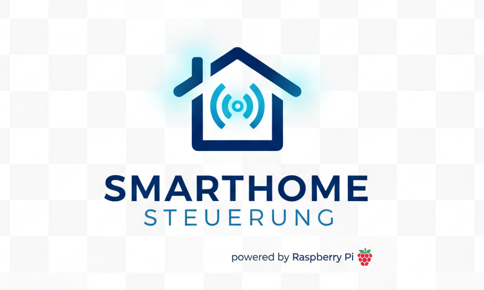

# BattenPi – Smart-Home Dashboard für ioBroker

**Ein PHP-basiertes Dashboard zur Steuerung und Protokollierung von Smarthome-Geräten über die ioBroker Simple-API**

---

## 📋 Projekt-Übersicht

**BattenPi** ist ein vollständig angepasstes Smart-Home-Kontrollzentrum für Android-Wandtablets im 10-Zoll-Format (Hochformat). Das System kommuniziert in Echtzeit mit der **ioBroker Simple-API** und ermöglicht die intuitive Steuerung von Haushaltsgeräten, Leuchten und anderen intelligenten Endgeräten. Das Projekt wurde speziell für die Kiosk-App **Fully Kiosk Browser** optimiert und bietet ein robustes Fehlermanagement mit Diagnostic-Boot-Checks.

### 🎯 Kernfunktionen

- ✅ **Diagnostischer System-Boot-Check** – Automatische Überprüfung von Netzwerk, Apache, MySQL und ioBroker beim Starten  
- ✅ **Intelligente Gerätesteuerung** – Ein-/Ausschalten von smarten Steckdosen (Tasmota, Zigbee, etc.)  
- ✅ **Dimm-Funktionalität** – Stufenlose Helligkeitsregelung von Leuchten via Slider  
- ✅ **RGB-Farbauswahl** – Interaktiver Farbwähler für Farblicht-Zonen  
- ✅ **Echtzeit-Verbrauchsüberwachung** – Live-Leistungswerte (Watt) mit historischer Datenbank-Protokollierung  
- ✅ **Chart.js-Visualisierung** – Grafische Darstellung von Verbrauchsdaten im Zeit-Diagramm  
- ✅ **NFC-Kartenerkennung** – Integration von physischen NFC-Karten zur Automation  
- ✅ **Benutzer-Verwaltung** – Session-Schutz mit Login, Registration und Logout  
- ✅ **Dark-Mode UI** – Optimiert für Wandtablet-Nutzung am Tag und in der Nacht  
- ✅ **Kiosk-Mode Ready** – Vollständig kompatibel mit Fully Kiosk Browser App  

---

## 📁 Repository-Struktur & Dateiübersicht

### Verzeichnisbaum

BattenPi/
├── assets/
│   └── pi_SHS.png                    # Dashboard-Logo und Branding-Bilder
├── css/
│   └── style.css                     # Dark-Mode Stylesheet für alle UI-Elemente
├── js/
│   └── dashboard.js                  # Zentrale Frontend-Logik (Fetch, Navigation, Events)
├── waschmaschine/
│   ├── index.php                     # Haupt-Steuerseite für Waschmaschinen-Modul
│   ├── log_wm.php                    # Logging-Interface für Verbrauchsdaten
│   ├── waschprogam.db.php            # Datenbank-Handler für Programme und Protokolle
│   └── wm_debug.txt                  # Lokaler Debug-Fehlerlog
├── admin.php                         # Admin-Konsole für Geräteverwaltung & Datenpunkte
├── api_nfc.php                       # NFC-Karten-API Endpunkt
├── current_nfc_register_uid.txt      # Temporäre NFC-UID Registry
├── index.php                         # Haupt-Dashboard mit Dimmern, RGB, Steckdosen
├── intro.php                         # Diagnose-Bootscreen mit System-Checks
├── login.php                         # Login-Formular mit Session-Schutz
├── logout.php                        # Session-Cleanup und Redirect
├── register.php                      # Benutzer-Registrierungsseite
├── config.php                        # Zentrale Konfigurationsdatei (WICHTIG!)
└── README.md                         # Diese Dokumentation

### 📄 Detaillierte Datei-Erklärungen

| Datei/Verzeichnis | Funktion | Abhängigkeiten |
|---|---|---|
| **assets/** | Speicher für Bilder, Logos und statische Medien | – |
| **css/style.css** | Zentrales Stylesheet mit Dark-Mode-Design für responsive Tablet-UI | – |
| **js/dashboard.js** | Fetch/AJAX-Logik für ioBroker-API, Event-Listener, Slider, Navigation | ioBroker einfache API, config.php |
| **waschmaschine/index.php** | Haupt-UI für Waschmaschinen-Modul mit Live-Leistungsanzeige | log_wm.php, waschprogam.db.php, config.php |
| **waschmaschine/log_wm.php** | Behandlung von Verbrauchsdaten-Requests, Speicherung in MySQL | MySQL-DB (wm_protocol Tabelle) |
| **waschmaschine/waschprogam.db.php** | DB-Wrapper für Program-Liste und Protokoll-Abfragen | MySQL-DB (waschmaschine_programme Tabelle) |
| **waschmaschine/wm_debug.txt** | Fehler-Log für lokales Debugging | – |
| **admin.php** | Verwaltungskonsole zum Konfigurieren von Geräten und ioBroker-Datenpunkten | config.php, Session-Schutz |
| **api_nfc.php** | REST-API Endpunkt zur NFC-Kartenverwaltung | current_nfc_register_uid.txt |
| **current_nfc_register_uid.txt** | Temporäre Registry für aktuell zu registrierende NFC-UIDs | – |
| **index.php** | Haupt-Dashboard mit Gerätelisten, Dimmern, RGB-Wähler, Steckdosen-Status | dashboard.js, config.php, ioBroker |
| **intro.php** | Diagnose-Bootscreen mit POST-Checks (Netzwerk, Apache, MySQL, ioBroker) | config.php, alle Backend-Services |
| **login.php** | Authentifizierungs-Formular mit Session-Verwaltung | config.php |
| **logout.php** | Session-Cleanup und Redirect zur Login-Seite | – |
| **register.php** | Benutzer-Registrierungsseite (wichtig für Erstnutzung) | config.php |
| **config.php** | 🔴 KRITISCH: Zentrale Konfiguration mit ioBroker-Datenpunkten, DB-Credentials, Passwörtern | MySQL, ioBroker |

---

## 🚀 Installationsanleitung

### Voraussetzungen

- Linux Server (Raspberry Pi, NAS, oder VM) mit PHP 8.2+, Apache 2.4+ (mod_rewrite aktiv), MySQL 5.7+ / MariaDB 10.3+ sowie den Extensions php-curl und php-mysql
- ioBroker Installation mit aktivierter Simple-API
- Android-Tablet mit installierter Fully Kiosk Browser App
- Netzwerk-Konnektivität zwischen allen Komponenten

### Schritt 1: Repository klonen

cd /var/www/html
git clone https://github.com/philipplindner-media-network/BattenPi.git
cd BattenPi

### Schritt 2: Datei-Schreibrechte setzen

sudo chown -R www-data:www-data /var/www/html/BattenPi
sudo chmod -R 755 /var/www/html/BattenPi
sudo chmod 666 /var/www/html/BattenPi/waschmaschine/wm_debug.txt
sudo chmod 666 /var/www/html/BattenPi/current_nfc_register_uid.txt
sudo chmod 777 /var/www/html/BattenPi

### Schritt 3: MySQL-Datenbank und Tabellen erstellen

Führe diese Befehle in deinem MySQL-Interface aus, um das korrekte Datenbankschema aufzubauen:

CREATE DATABASE IF NOT EXISTS batten_pi DEFAULT CHARACTER SET utf8mb4 COLLATE utf8mb4_unicode_ci;
USE batten_pi;

CREATE TABLE `access_levels` (
  `id` int(11) NOT NULL AUTO_INCREMENT,
  `level_name` varchar(50) NOT NULL COMMENT 'Name der Stufe (z.B. Admin, User, Gast)',
  `description` text DEFAULT NULL COMMENT 'Beschreibung der Rechte',
  PRIMARY KEY (`id`)
) ENGINE=InnoDB DEFAULT CHARSET=utf8mb4;

CREATE TABLE `remote_buttons` (
  `id` int(11) NOT NULL AUTO_INCREMENT,
  `parent_id` int(11) DEFAULT 0,
  `label` varchar(50) DEFAULT NULL,
  `type` varchar(20) NOT NULL,
  `io_id` varchar(100) DEFAULT NULL,
  `status_id` varchar(255) DEFAULT NULL,
  `icon` varchar(50) DEFAULT NULL,
  `color` varchar(7) DEFAULT '#333333',
  `dimmer_id` varchar(255) DEFAULT NULL,
  `color_id` varchar(255) DEFAULT NULL,
  `min_level` int(11) DEFAULT 10,
  `position` int(11) NOT NULL DEFAULT 0,
  PRIMARY KEY (`id`)
) ENGINE=InnoDB DEFAULT CHARSET=utf8mb4;

CREATE TABLE `Templog` (
  `id` int(11) NOT NULL AUTO_INCREMENT,
  `name` text NOT NULL,
  `Task` text NOT NULL,
  `Valuename` text NOT NULL,
  `Value` varchar(100) NOT NULL,
  `uploade` timestamp NOT NULL DEFAULT current_timestamp() ON UPDATE current_timestamp(),
  PRIMARY KEY (`id`)
) ENGINE=InnoDB DEFAULT CHARSET=latin1 COMMENT='Mesdaten Loger';

CREATE TABLE `user` (
  `id` int(11) NOT NULL AUTO_INCREMENT,
  `rfid` text NOT NULL,
  `name` text NOT NULL,
  `level` varchar(2) NOT NULL,
  `email` text NOT NULL,
  `telegram` text NOT NULL,
  `regDatum` timestamp NOT NULL DEFAULT current_timestamp() ON UPDATE current_timestamp(),
  `password` text NOT NULL,
  `logkey` text NOT NULL,
  PRIMARY KEY (`id`)
) ENGINE=InnoDB DEFAULT CHARSET=latin1;

CREATE TABLE `users` (
  `id` int(11) NOT NULL AUTO_INCREMENT,
  `username` varchar(50) NOT NULL COMMENT 'Benutzername für manuelle Logins/Anzeige',
  `RFID` varchar(255) NOT NULL COMMENT 'Der RFID-/NFC-/QR-/Barcode-Wert',
  `name` varchar(100) NOT NULL COMMENT 'Vollständiger Name des Benutzers',
  `level_id` int(11) NOT NULL COMMENT 'Zugriffslevel (Verweis auf access_levels.id)',
  `created_at` datetime NOT NULL DEFAULT current_timestamp(),
  `chip_uid` varchar(255) DEFAULT NULL COMMENT 'NFC/RFID UID',
  `qr_code` varchar(255) DEFAULT NULL COMMENT 'QR-Code Wert',
  `barcode` varchar(255) DEFAULT NULL COMMENT 'Barcode Wert',
  PRIMARY KEY (`id`),
  UNIQUE KEY `access_code_unique` (`RFID`),
  UNIQUE KEY `chip_uid` (`chip_uid`),
  UNIQUE KEY `qr_code` (`qr_code`),
  UNIQUE KEY `barcode` (`barcode`),
  KEY `level_id` (`level_id`)
) ENGINE=InnoDB DEFAULT CHARSET=utf8mb4;

CREATE TABLE `waschmaschine_programme` (
  `id` int(11) NOT NULL AUTO_INCREMENT,
  `label` varchar(100) NOT NULL,
  `duration_seconds` int(11) NOT NULL,
  `category` varchar(50) DEFAULT 'Standard',
  `extra_time_minutes` int(11) DEFAULT 30,
  PRIMARY KEY (`id`)
) ENGINE=InnoDB DEFAULT CHARSET=utf8mb4;

CREATE TABLE `wm_protocol` (
  `id` int(11) NOT NULL AUTO_INCREMENT,
  `timestamp` datetime DEFAULT current_timestamp(),
  `program_name` varchar(100) DEFAULT NULL,
  `wattage` decimal(10,2) DEFAULT NULL,
  `voltage` decimal(10,2) DEFAULT NULL,
  PRIMARY KEY (`id`)
) ENGINE=InnoDB DEFAULT CHARSET=utf8mb4;

ALTER TABLE `users` ADD CONSTRAINT `users_ibfk_1` FOREIGN KEY (`level_id`) REFERENCES `access_levels` (`id`) ON DELETE CASCADE ON UPDATE CASCADE;
COMMIT;

### Schritt 4: config.php konfigurieren

Passe die Werte in deiner config.php entsprechend an deine Serverumgebung an:

// --- DATENBANK KONFIGURATION ---
define('DB_HOST', 'localhost');
define('DB_USER', 'smarthome');
define('DB_PASS', 'DeinSicheresPasswort');
define('DB_NAME', 'smarthome');

// --- IOBROKER KONFIGURATION ---
define('IO_BROKER_IP', '192.168.1.100'); 
define('IO_BROKER_PORT', '8087');

// --- SYSTEM EINSTELLUNGEN ---
define('APP_NAME', 'BattenPi Control');
define('UPDATE_INTERVAL_VALUES', 10000); // Live-Werte alle 10 Sek.
define('UPDATE_INTERVAL_PING', 5000);    // Ping alle 5 Sek.
define('GRID_COLUMNS', 4);
define('GRID_ROWS', 3);

// --- IOBROKER STATES FÜR STATUS ---
define('IO_CHECK_STATE', 'system.adapter.admin.0.alive');

### 📌 Wichtiger Hinweis zu Smart-Home Geräten
Neue Smart-Home Geräte und deren ioBroker-Datenpunkte können direkt im Frontend über das Administrations-Menü unter `./admin.php` eingepflegt werden. Voraussetzung hierfür ist, dass der aktuell angemeldete Benutzer in der Datenbank mindestens die Berechtigungsstufe **Level 10** zugewiesen hat.

### 🔴 Erstnutzung & Benutzer-Registrierung
Bei der allerersten Inbetriebnahme des Dashboards existieren noch keine Profile in der Benutzerverwaltung. Rufe daher nach der Server-Einrichtung zwingend zuerst die Seite `http://DEINE_SERVER_IP/BattenPi/register.php` auf, um deinen Hauptbenutzer manuell anzulegen. Sorge danach in der Datenbank dafür, dass dieser Benutzer für den Admin-Zugriff auf das entsprechende Level (z.B. Level 10) gesetzt wird.

### Schritt 5: Apache Virtual Host konfigurieren (optional)

Für die Nutzung einer lokalen Domain kann folgender VirtualHost eingerichtet werden:

<VirtualHost *:80>
    ServerName batten-pi.local
    ServerAlias batten-pi
    DocumentRoot /var/www/html/BattenPi
    <Directory /var/www/html/BattenPi>
        Options Indexes FollowSymLinks
        AllowOverride All
        Require all granted
        RewriteEngine On
        RewriteBase /
        RewriteCond %{REQUEST_FILENAME} !-f
        RewriteCond %{REQUEST_FILENAME} !-d
    </Directory>
    ErrorLog ${APACHE_LOG_DIR}/batten-pi-error.log
    CustomLog ${APACHE_LOG_DIR}/batten-pi-access.log combined
</VirtualHost>

Danach die Konfiguration aktivieren:
sudo a2enmod rewrite
sudo systemctl reload apache2

### Schritt 6: Startup-Test durchführen

Öffne die Diagnose-Übersicht in deinem Browser:
http://DEINE_SERVER_IP/BattenPi/intro.php

Das System führt automatisierte Routine-Checks aus:
- ✅ Netzwerk-Erreichbarkeit
- ✅ Apache Webserver-Status
- ✅ MySQL-Datenbankverbindung
- ✅ ioBroker Simple-API Antwortverhalten

Nach erfolgreicher Verifizierung aller Systemkomponenten leitet das Intro direkt auf das Haupt-Dashboard (index.php) weiter.

---

## 📱 Fully Kiosk Browser – Konfigurationsanleitung

### Schritt 1: Installation
Installiere die App "Fully Kiosk Browser" (von Olli Förterer) direkt aus dem Google Play Store auf deinem Android-Wandtablet.

### Schritt 2: Start-URL definieren
Öffne das linke Seitenmenü in Fully Kiosk, navigiere zu "Settings" -> "Web Content Settings" und trage im Feld "Start URL" folgendes ein:
http://DEINE_SERVER_IP/BattenPi/intro.php?view=portrait

### Schritt 3: Hochformat erzwingen
Gehe zu "Settings" -> "Device Management", aktiviere die Option "Lock Orientation" und setze diese fest auf "Portrait".

### Schritt 4: Netzwerk-Verhalten absichern
Unter "Settings" -> "Web Auto Reload" die Optionen "Reload on Network Reconnect" sowie "Reload on Internet Reconnect" aktivieren. Setze zudem "Reload on Page Error" auf aktiv, um Verbindungsabbrüche im WLAN automatisch abzufangen.

### Schritt 5: Formular-Resubmission erlauben
Navigiere zu "Settings" -> "Web Browsing Settings" und schalte "Resubmit Forms after Page Reload" ein. Das verhindert lästige Bestätigungs-Popups bei automatischen Reloads.

### Schritt 6: Dauerbetrieb einrichten
Unter "Settings" -> "Device Management" den Regler für "Screen On Timeout" auf das Maximum stellen, "Keep Screen On" aktivieren und "Turn Off Screen on Inactivity" abschalten, damit das Display der Steuerungszentrale permanent aktiv bleibt.

---

## 🔌 API-Referenz

### ioBroker Simple-API Endpunkte
GET http://<IOBROKER_HOST>:8087/get/<object_id>
POST http://<IOBROKER_HOST>:8087/set/<object_id>?value=<value>

### NFC-API Endpunkt (api_nfc.php)
POST /BattenPi/api_nfc.php
Content-Type: application/json

{
  "action": "register",
  "uid": "04AA1234567890",
  "card_name": "Waschmaschinen-Starter",
  "automation_action": "start_washing_machine"
}

---

## 🛠️ Troubleshooting

### Dashboard zeigt eine weiße Seite
Rufe manuell die /BattenPi/intro.php auf, um zu sehen, welcher System-Check fehlschlägt. Kontrolliere die MySQL-Zugangsdaten innerhalb der config.php.

### ioBroker meldet Verbindungs-Timeouts
Überprüfe die hinterlegte IP und den Port der Simple-API in der config.php. Vergewissere dich, dass der zugehörige Instanz-Adapter im ioBroker läuft und Zugriffe nicht durch Firewall-Regeln blockiert werden.

### Fehler beim Schreiben von NFC-Registrierungen
Kontrolliere die Dateiberechtigungen auf Betriebssystemebene und korrigiere sie gegebenenfalls mit:
sudo chmod 666 /var/www/html/BattenPi/current_nfc_register_uid.txt
sudo chown www-data:www-data /var/www/html/BattenPi/current_nfc_register_uid.txt

---

## 📝 Lizenz

Dieses Projekt steht unter den Bedingungen der MIT-Lizenz.

Copyright (c) 2026 Philipp Lindner (Philipp Lindner Media & Network Group)

Hiermit wird allen Personen, die eine Kopie dieser Software erhalten, das zeitlich unbeschränkte Recht eingeräumt, die Software kostenfrei und ohne Einschränkung zu nutzen, zu kopieren, zu modifizieren, zu veröffentlichen und zu verbreiten, solange der obige Urheberrechtshinweis in allen Kopien oder Teilstücken der Software enthalten bleibt.

---

**Zuletzt aktualisiert:** Juni 2026  
**Version:** 1.0.0
